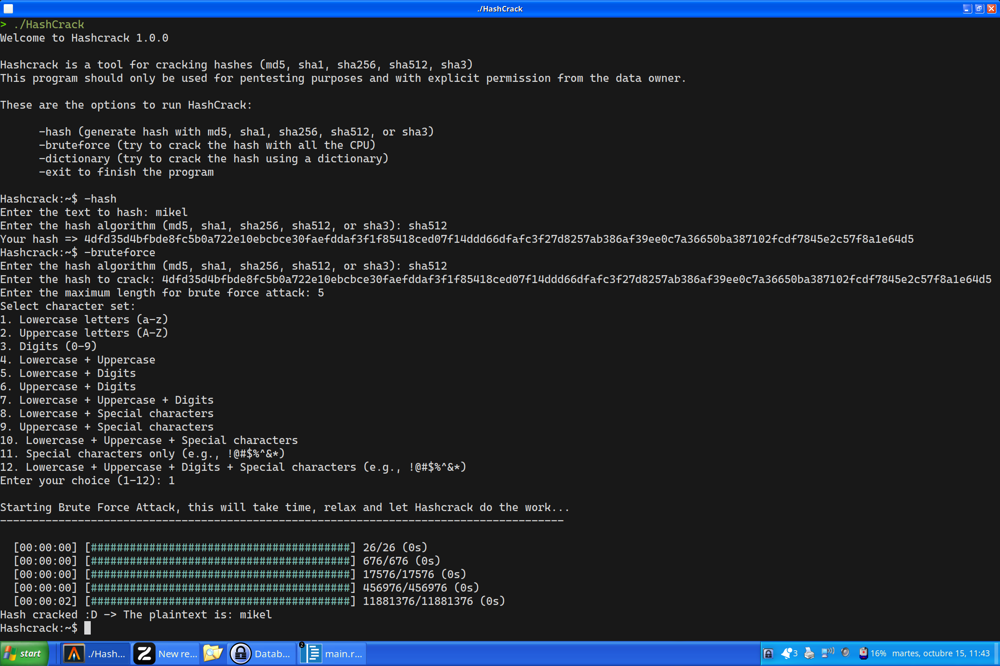

# HashCrack (Rust Hash Cracker)

HashCrack is an efficient and powerful tool for recovering passwords from hashes. Designed in Rust, this program leverages the speed and security of the language to perform brute-force and dictionary attacks, allowing users to effectively recover lost passwords.

The original idea was from Obsesor repository from @AbbysWatcher

AbbysWatcher github: https://github.com/UnknownArtistt

AbbysWatcher project: https://github.com/UnknownArtistt/Obsesor



## DISCLAIMER!!!

HashCrack is a powerful tool designed for recovering passwords from hashes. While this program can be highly effective for password recovery, it is essential to use it ethically and responsibly. The intended use of HashCrack is for legitimate purposes only, such as security auditing, penetration testing, and educational research. Unauthorized use of this software against systems without permission may be illegal and unethical.

By using HashCrack, you acknowledge that you are solely responsible for any consequences arising from your use of this tool. The developers of HashCrack disclaim any liability for misuse or unlawful activities conducted with this software.

Always ensure you have explicit permission to test the security of systems and data before using HashCrack. Use this tool to promote security awareness and protect against potential threats.

## Key Features

- **Support for Multiple Hash Algorithms:**  
  Compatible with various hash algorithms, including MD5, SHA-1 (developing), and SHA-256, ensuring versatility in password recovery.

- **Efficiency and Performance:**  
  Implemented with Rust's efficiency, the program offers superior performance compared to other languages, allowing for rapid processing of large data volumes.

- **User-Friendly Command-Line Interface:**  
  Provides a simple and clear interface that enables users to quickly initiate the cracking process without complications.

- **Customizable Attack Modes:**  
  Allows users to choose between different attack methods, such as brute force, dictionary attacks (developing) , and combinations, adapting to different needs.

- **Progress Logging and Tracking:**  
  Includes logging features that allow users to track the cracking progress and view real-time statistics.

## Typical Use

HashCrack is ideal for cybersecurity professionals, researchers, and enthusiasts who need to recover passwords in an ethical and responsible manner. Its robust and efficient design makes it an essential tool for security auditing and data recovery.

## Requirements

- **Rust:**  
  Ensure you have Rust installed on your system to compile and run the program.

- **Dependencies:**  
  Check the dependencies in the `Cargo.toml` file to ensure everything is set up correctly.

## Installation

1. Clone the repository:

   ```bash
   git clone https://github.com/Bluegamer75/HashCrack.git
   cd HashCrack

2. Run the program

    ```rust
    cargo build --release
    cargo run --release
