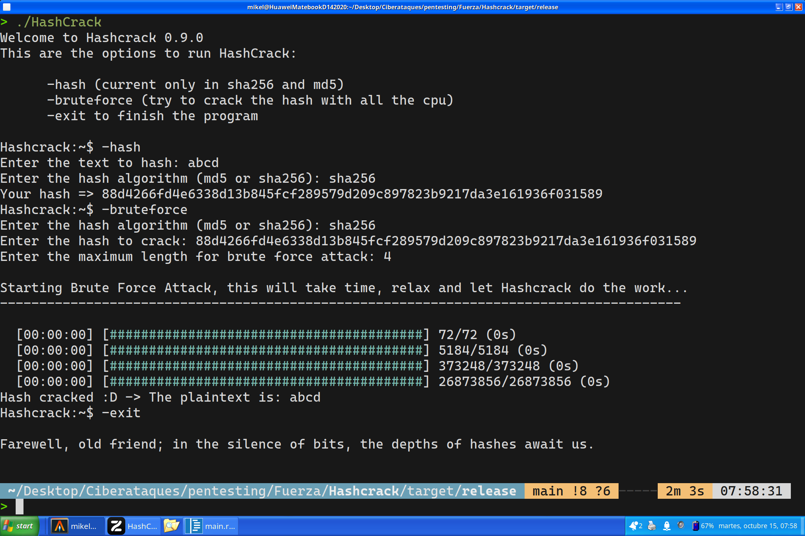

# Rust Hash Cracker

Rust Hash Cracker is an efficient and powerful tool for recovering passwords from hashes. Designed in Rust, this program leverages the speed and security of the language to perform brute-force and dictionary attacks, allowing users to effectively recover lost passwords.



## Key Features

- **Support for Multiple Hash Algorithms:**  
  Compatible with various hash algorithms, including MD5, SHA-1, and SHA-256, ensuring versatility in password recovery.

- **Efficiency and Performance:**  
  Implemented with Rust's efficiency, the program offers superior performance compared to other languages, allowing for rapid processing of large data volumes.

- **User-Friendly Command-Line Interface:**  
  Provides a simple and clear interface that enables users to quickly initiate the cracking process without complications.

- **Customizable Attack Modes:**  
  Allows users to choose between different attack methods, such as brute force, dictionary attacks, and combinations, adapting to different needs.

- **Progress Logging and Tracking:**  
  Includes logging features that allow users to track the cracking progress and view real-time statistics.

## Typical Use

Rust Hash Cracker is ideal for cybersecurity professionals, researchers, and enthusiasts who need to recover passwords in an ethical and responsible manner. Its robust and efficient design makes it an essential tool for security auditing and data recovery.

## Requirements

- **Rust:**  
  Ensure you have Rust installed on your system to compile and run the program.

- **Dependencies:**  
  Check the dependencies in the `Cargo.toml` file to ensure everything is set up correctly.

## Installation

1. Clone the repository:

   ```bash
   git clone https://github.com/Bluegamer75/HashCrack.git
   cd HashCrack

2. Run the program

    ```rust
    cargo build --release
    cargo run --release
